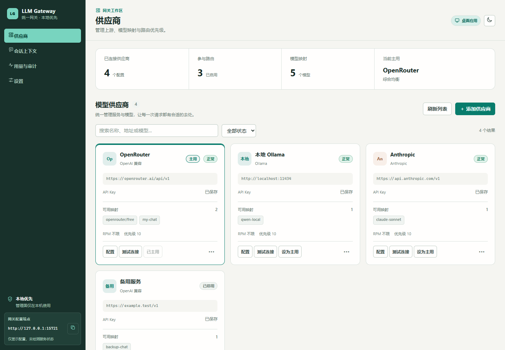
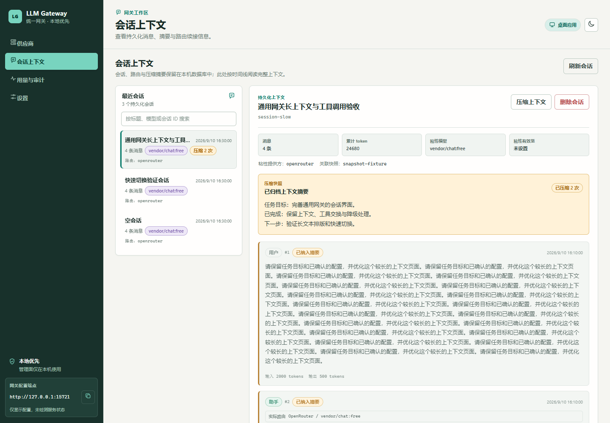
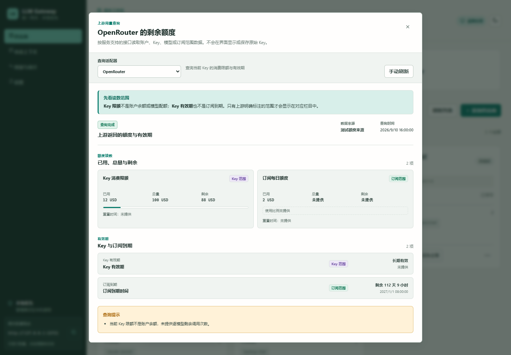
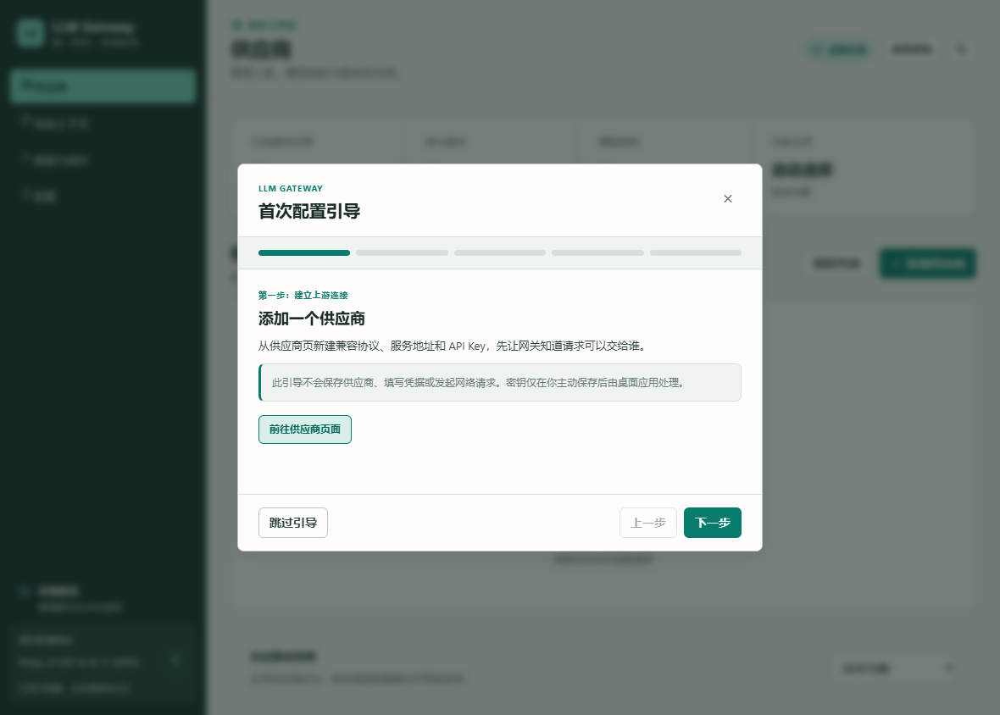
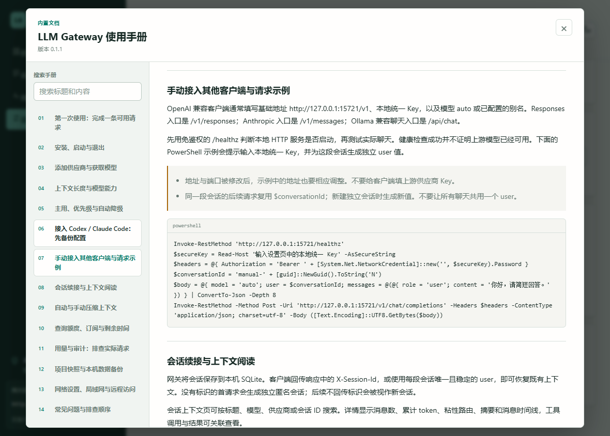

# 模型配置与界面使用指南

第一次使用请先阅读[完整使用手册](使用手册.md)或[离线 HTML 手册](使用手册.html)。应用顶部「使用帮助」可重新打开首次引导和离线手册；本文进一步说明模型目录、额度和备份机制。

## 界面预览

以下截图由隔离的界面回归生成，全部使用演示数据，不包含用户的真实 Key、会话或账户余额。额度截图故意组合 Key 和订阅字段以验证布局，不代表 OpenRouter 会返回订阅信息；各平台实际能力见下文适配表。











## 从 API 地址和 Key 添加模型

1. 打开「供应商」，点击「添加供应商」。可先选服务预设，再填写自己的 API 地址和 Key。
2. 点击「获取支持模型」。OpenAI 兼容、Anthropic、Ollama 支持粘贴基础地址或常见完整聊天接口地址；网关会规范化为对应协议的基础地址。Gemini 请填写 API 根地址或模型目录地址（例如 `https://generativelanguage.googleapis.com/v1beta` 或其 `/models` 地址），不要使用带模型名的 `:generateContent` URL。
3. 按模型名称或 ID 搜索，可筛选免费模型、工具调用或视觉能力；勾选所需项目后点击「添加所选模型」。
4. 检查每个模型的对外别名、上下文长度与能力，保存后在供应商卡片中测试连接。

获取模型目录不会发送聊天请求。目录可见只说明上游返回了这个模型，不保证当前 Key 有调用权限、余额或免费额度。免费筛选仅使用上游明确返回的价格信息，不把价格未知的模型标记为免费。目录接口不支持、返回鉴权错误或超时后，仍可手动添加模型；预设名称只是配置参考，不代表实测可用。

| 协议 | 获取方式 | 上下文信息 |
| --- | --- | --- |
| OpenAI 兼容 | 基础地址下的 `/models` | 读取目录中提供的上下文与能力字段；OpenRouter 可提供较完整的元数据 |
| Anthropic | `/models` | 使用返回字段；没有长度时使用默认值 |
| Gemini | `/models`，处理分页 | 优先使用 `inputTokenLimit` |
| Ollama | `/api/tags`，按需读取 `/api/show` | 使用模型信息中的上下文配置；该值不一定等于服务器当前实际分配值 |

编辑已有供应商时，Key 留空可以沿用已保存的密钥；修改地址或协议后需要重新填写 Key，防止原凭据意外发送到另一服务。复制供应商配置不会复制密钥，副本默认停用。

## 上下文长度如何确定

新模型优先使用上游返回的有效长度，界面标为「上游提供」。上游没有返回时，默认填入 **32,768 tokens**，标为「默认值 · 待确认」；可以在连接信息中调整这个默认值，但它只影响之后新添加且缺少元数据的模型。

已保存模型不会因再次获取目录而自动覆盖。手动调整后显示「手动设置」，需要时可显式点击「采用上游长度」。工具、视觉能力未识别时不默认启用，流式响应默认启用但允许调整。请根据实际服务限制确认这些字段。

上下文长度会参与网关的容量检查、压缩与降级候选判断，填大了可能导致上游拒绝请求。模型上下文上限、账户配额和单次最大输出长度是不同限制。已有配置的长度保持原值，不会统一改为 32,768。

含冒号的完整模型名（例如 `vendor/chat:free`、`qwen:latest`）先按已配置的名称匹配；没有完整匹配时才解释为 `供应商:模型`。因此也可以使用 `openrouter:vendor/chat:free` 限定供应商。

## 供应商的常用操作

供应商页面提供名称、地址与模型搜索，启用状态筛选、模型数量概览和连接耗时。卡片中的「配置」「测试连接」「设为主用」用于日常操作，更多菜单提供停用、复制配置、优先级调整与删除。主用供应商仍需满足健康状态、能力与上下文等约束。

浏览器开发预览与 Tauri 桌面运行分开：普通浏览器没有本机 IPC 权限，不会展示伪造的生产数据。自动化界面回归在独立浏览器上下文注入测试数据，不接触用户的真实供应商或会话。

## 修改客户端配置前备份

「设置」中的客户端接管支持 Claude Code 和 Codex。已有文件必须先创建唯一备份并核对字节内容，所有所选文件的备份都成功后才开始写入新配置。备份失败或原文件无法安全解析时，停止修改并保留原文件。首次创建的文件没有原件，结果会明确标记为新建。多个文件不是跨文件事务：如果写入阶段发生错误，已写入项目不会自动回滚，错误信息会列出本次所有已验证备份路径。

Codex 接管会选择独立的 `model_providers.llm_gateway`、`responses` 协议和网关虚拟模型 `auto`，将本地统一 Key 写入该供应商的 `experimental_bearer_token`。它不会替换其它供应商定义，原模型选择和文件字节内容保存在备份中；TOML/JSON 会重新格式化，原注释可在备份中查看。这里使用本地统一 Key，不把上游供应商密钥写入客户端配置。官方配置结构见 [OpenAI Codex 配置参考](https://learn.chatgpt.com/docs/config-file/config-reference)。

目前网关支持 Gemini **上游**，尚未提供 Gemini 原生**入站**路由，因此暂不开放 Gemini CLI 自动接管。旧配置如果勾选了此项，需要先取消；后端也会在改写任何文件前拒绝不支持的接管。其他客户端可通过现有 OpenAI、Responses、Anthropic 或 Ollama 入口接入。

操作结果逐项显示目标文件和备份文件的完整路径。请妥善保留这些备份，因为原配置可能含有客户端凭据。需要回退时，先关闭对应客户端，保存当前文件，再将结果中指定的备份复制回原路径。每次接管都会生成新的备份，不覆盖上一份。

## 查看官网额度与订阅剩余时间

在供应商卡片的「更多操作」中点击「查询额度 / 有效期」。打开后执行一次只读查询，可以手动刷新或切换适配方式。查询只使用当前供应商已经保存的 Key，地址始终保留原服务的域名、端口和部署前缀；不会将中转服务的 Key 发送给另一家官网，也不会登录网站或读取浏览器 Cookie。

| 适配方式 | 可展示的数据 | 具体边界 |
| --- | --- | --- |
| OpenRouter | 当前 Key 的总消费限额、已用、剩余、Key 到期时间 | `/api/v1/key`；不是账户总余额，不提供逐免费模型剩余次数 |
| DeepSeek | 账户余额，按 CNY / USD 分开 | `/user/balance`；余额含未过期赠送金额，不提供订阅到期时间 |
| New API 兼容 | Key 的已用额度、剩余额度、是否不限额、Key 到期 | `/api/usage/token`；使用站点原始额度单位，不猜测兑换比例 |
| Sub2API 兼容 | Key 限额与重置时间、钱包余额、订阅日/周/月限额、订阅到期；若有则展示模型消费 | `/v1/usage`；部署版本和 Key 类型决定返回哪些字段 |

自动识别对 OpenRouter 和 DeepSeek 使用官方协议；其他中转地址尝试 New API / Sub2API 的只读接口。SenseNova、智谱、OpenAI、Anthropic 和 Gemini 官方端点当前没有本项目已适配的、仅凭推理 Key 即可通用查询全部余额和订阅信息的接口，会明确提示到控制台查看，也可以在自己确认接口兼容时手动选择适配方式。

Key“未设消费上限”只说明没有给这把 Key 单独设限，不代表账户余额无限。Key 到期时间与订阅到期时间分别展示，前端根据上游明确的到期时间计算剩余天数/小时；缺失时间显示「未提供」。未返回的金额同样显示「未提供」，与真实的 `0` 区分。单模型已用费用不能用于推算免费模型剩余调用次数。

每次查询最长 25 秒，单响应不超过 1 MiB；不接受重定向。查询失败会清除当前弹窗中的旧读数并显示错误，切换适配方式后较晚返回的旧请求不会覆盖新结果。不会把余额用于自动禁用供应商或改变现有路由策略。

协议字段参考 [OpenRouter 当前 Key 文档](https://openrouter.ai/docs/api/api-reference/api-keys/get-current-key)、[DeepSeek 余额接口](https://api-docs.deepseek.com/api/get-user-balance/)、[New API Token 查询源码](https://github.com/QuantumNous/new-api/blob/main/controller/token.go)及 [Sub2API Usage 源码](https://github.com/Wei-Shaw/sub2api/blob/main/backend/internal/handler/gateway_handler.go)。

## 阅读会话上下文

会话列表可按标题、模型、供应商或会话 ID 搜索。详情集中展示消息数、累计 token、粘性模型、有效时间、关联快照与摘要，下面按时间顺序保留消息正文、真实上游路由和工具调用关联。已压缩消息使用独立标记，仍保留在审计视图中。

宽窗口使用列表与详情两栏，窄窗口上下排列；长摘要在固定区域内滚动，消息文本与工具 JSON 自动换行。快速切换会话时，旧加载请求不会覆盖当前会话。压缩和删除执行期间会锁定会话选择及相应按钮，避免重复操作。

## 托盘与窗口

程序只由 Rust 创建一个托盘图标，图标资源和事件处理在同一个入口绑定。左键单击恢复并聚焦主窗口，右键显示「打开控制面板」「退出」菜单；点击窗口关闭按钮会隐藏到托盘。退出后台服务应使用托盘菜单的「退出」。

## 开发者界面回归

执行 `npm ci` 后先用 `npm run dev` 启动开发服务器，在另一个终端运行浏览器回归。Playwright 已作为开发依赖锁定；默认使用 Playwright 自带 Chromium（首次使用运行 `npx playwright install chromium`），也可以通过环境变量选择已安装的 Edge 或 Chrome：

```powershell
# Playwright 安装在外部工具目录时，可指定该模块的绝对路径。
# 不指定 LLMGW_PLAYWRIGHT_PATH 时，使用正常的 Node.js 模块解析。
$env:LLMGW_BROWSER_CHANNEL = 'msedge'
npm run verify:ui
```

`LLMGW_UI_URL` 可指定开发服务器地址，默认 `http://127.0.0.1:5173`。截图默认输出到系统临时目录的 `llm-gateway-ui`，可用 `LLMGW_UI_OUTPUT` 指定其他输出目录。测试数据不包含真实 Key。

## 参考项目

- [CC Switch 供应商编辑指南](https://github.com/farion1231/cc-switch/blob/main/docs/user-manual/en/2-providers/2.3-edit.md)：参考填写连接信息后获取模型、服务预设和密钥显示切换的交互。
- [CC Switch Codex 会话历史迁移指南](https://github.com/farion1231/cc-switch/blob/main/docs/guides/codex-unified-session-history-guide-en.md)：参考修改前备份与明确展示恢复路径的操作习惯。
- [New API 模型目录说明](https://github.com/QuantumNous/new-api-docs/blob/main/docs/en/api/get-available-models-list.md)：参考可选模型目录的呈现；本项目使用供应商协议的目录接口，不混用 New API 管理接口的鉴权语义。

上述项目用于设计参考。本项目的模型发现、凭据复用约束、配置备份和 UI 代码在当前 Rust/Tauri 架构中实现。
